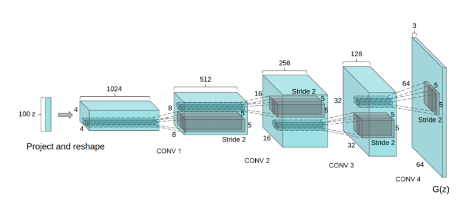
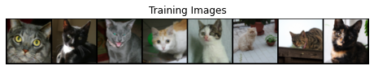
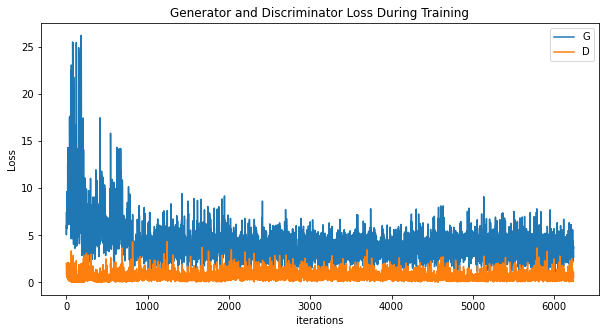
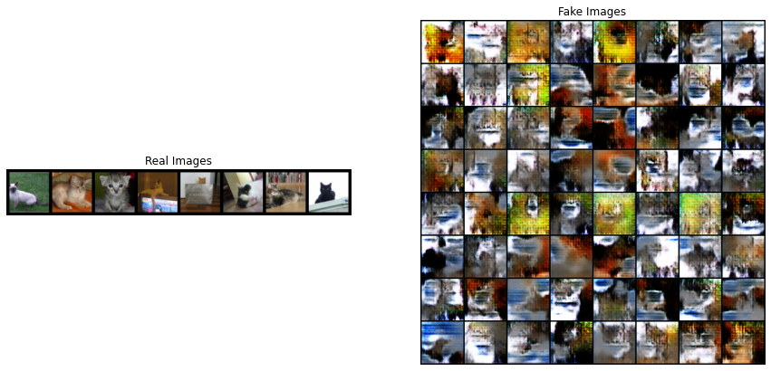

## DCGAN (Deep Convolutional Generative Adversarial Network)

This is a pytorch implementation of [Deep Convolutional Generative Adversarial Networks](http://arxiv.org/abs/1511.06434). 
The following image is the architecture of the network.

### Prerequisites

- Python 3.5 3.6
- torch == 1.2.0 (or higher)
- torchvision == 0.4.0 (or higher)

You can go to the official website of [pytorch](https://pytorch.org/get-started/locally/#windows-package-manager) to install torch/torchvision correctly.

### Usage

1. Download the dataset that you want this network to be trained on and put the data set into a `data` folder. You can also specify the path of your dataset with `--dataRoot` argument.   
2. Run `python train.py` with any arguments you want.

The following is the list of the arguments with explainations:

- **--batchSize** : (int) The batch size of your training set. The default value is `16`. Without a powerful GPU/CPU, A small batch size is recommended.
- **--imgSize** : (int) Size of your output images. The default value is `64`, which means the output images will be `64x64`.
- **--nz** : (int) Length of the latent `z` vector. The default value is `100`.
- **--ngf** : (int) Size of feature map in generator. The default value is `64`, which means the default feature map is set to `64x64`.
- **--ndf** : (int) Size of feature map in discriminator. The default value is `64`.
- **--epoch** : (int) The number of epochs that you want to train for. The The default value is `15`.
- **--lr** : (float) The learning rate of training. The The default value is `0.0002`.
- **--beta1** : (float) The beta1 for [Adam](https://arxiv.org/abs/1412.6980). The The default value is `0.5`.
- **--dataRoot** : (string) Folder of training data. The default path is `data/`.
- **--outdir** : (string) Folder for output images. The program will make a new folder if the given path does not exist. The default path is `./output`.
- **--ngpu** : (int) Number of GPUs available. Use 0 for CPU mode. The The default value is `1`.

### Example Training Output

Due to my limitations on GPU/CPU and network, I have only trained this network on a part of the [cat dataset](https://www.kaggle.com/crawford/cat-dataset)(about 3000 images) on kaggle. And the following is the training outcome on default argument settings (except for the batch size, I set it to `8`).

#### Training Images

#### Training Loss

#### Comparison between Fake Images and Training Images

### Reference
- [DCGAN Tutorial](https://pytorch.org/tutorials/beginner/dcgan_faces_tutorial.html)

